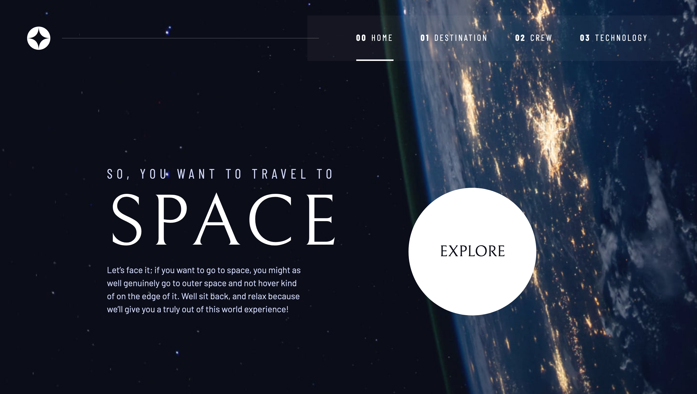

# Frontend Mentor - Space tourism website solution

This is a solution to the [Space tourism website challenge on Frontend Mentor](https://www.frontendmentor.io/challenges/space-tourism-multipage-website-gRWj1URZ3). Frontend Mentor challenges help you improve your coding skills by building realistic projects. 

## Table of contents

- [Overview](#overview)
  - [The challenge](#the-challenge)
  - [Screenshot](#screenshot)
  - [Links](#links)
- [My process](#my-process)
  - [Built with](#built-with)
  - [Overcoming major challenges](#overcoming-major-challenges)
  - [Continued development](#continued-development)
- [Author](#author)
- [Acknowledgments](#acknowledgments)

## Overview

### The challenge

Users should be able to:

- View the optimal layout for each of the website's pages depending on their device's screen size
- See hover states for all interactive elements on the page
- View each page and be able to toggle between the tabs to see new information

### Screenshot



### Links

- Solution URL: [GitHub Repo](https://github.com/bolouie/space-tourism-site-frontendmentor)
- Live Site URL: [GitHub Page](https://bolouie.github.io/space-tourism-site-frontendmentor/)

## My process

### Built with

- Semantic HTML5 markup
- CSS custom properties
- Flexbox
- CSS Grid
- Mobile-first workflow
- ARIA (Accessible Rich Internet Applications) roles, states, and properties

### Overcoming major challenges

On the technology page, I encountered issues with the tab-list outline indicators not updating correctly. The first tab number remained black, and the second tab number stayed white, regardless of the selected tab. To resolve this, I had to ensure the correct classes and attributes (aria-selected, tabindex) were applied to reflect the active/inactive state within the HTML.

Initially, my JavaScript did not handle class updates properly for active/inactive states. Although I managed the aria-selected attribute, I needed to consistently update the visual class for the active tab state. This required updating the tabindex and aria-selected attributes across all tabs. I also added CSS to differentiate active and inactive states. I revised the JavaScript to handle class management, attribute updates, and event handling correctly. 

```html
 <!-- tabs -->
  <div class="tab-list outline-indicators flex" role="tablist" aria-label="technology list">
    <button class="ff-serif fs-600 text-dark active" aria-selected="true" role="tab" aria-controls="vehicle-tab" tabindex="0" data-image="launch-vehicle-image"><span class="sr-only"></span>1</button>
    <button class="ff-serif fs-600 text-white" aria-selected="false" role="tab" aria-controls="spaceport-tab" tabindex="-1" data-image="spaceport-image"><span class="sr-only"></span>2</button>
    <button class="ff-serif fs-600 text-white" aria-selected="false" role="tab" aria-controls="capsule-tab" tabindex="-1" data-image="capsule-image"><span class="sr-only"></span>3</button>
  </div>

```
```css

.outline-indicators button {
    transition: color 0.3s ease;
}

.outline-indicators button.active {
    color: black; /* Active tab color */
}

.outline-indicators button:not(.active) {
    color: white; /* Inactive tab color */
}

```
```js
  /// Update active/inactive tab states
tabs.forEach(tab => {
  tab.classList.remove('active');
  tab.setAttribute('aria-selected', false);
  tab.classList.add('text-white'); // Set inactive tab text color
});

// Set the active tab
targetTab.classList.add('active');
targetTab.setAttribute('aria-selected', true);
targetTab.classList.remove('text-white'); // Remove inactive tab text color

```
With the above approach, I gained control of the tabs' visual active/inactive states and improved the user experience.

## Continued Development

I want to improve my JavaScript skills, particularly in handling events efficiently and preventing default behaviors. Also, I plan to learn more about ARIA (Accessible Rich Internet Applications) states and roles.

## Author

- Frontend Mentor - [@bolouie](https://www.frontendmentor.io/profile/bolouie)
- Twitter - [@bolouie](https://www.twitter.com/bo_louie)

## Acknowledgments

Big thanks to Scrimba and Kevin Powell for offering the free course [Build a Space Travel Website](https://scrimba.com/learn/spacetravel)! I loved every lesson, especially learning about accessibility best practices and responsive design. 

